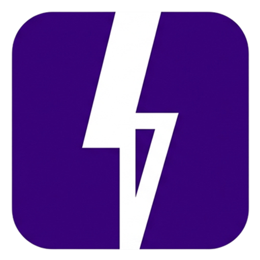

<p align="center">
  
</p>

<h1 align="center">ImgVault</h1>

<p align="center">
  <strong>Context-first media vault for images, videos, and links.</strong>
</p>

<p align="center">
  <a href="https://github.com/FahadBinHussain/imgvault/actions/workflows/nextgen-extension-crx.yml">
    
  </a>
  <a href="https://github.com/FahadBinHussain/imgvault/releases">
    
  </a>
  <a href="./LICENSE">
    
  </a>
  <a href="https://github.com/FahadBinHussain/imgvault/stargazers">
    
  </a>
</p>

## What Is ImgVault

ImgVault is a production-ready media vault ecosystem:

- Browser extension for fast capture and metadata-first workflows
- Native host companion for advanced download and local file handoff
- Web app for authenticated gallery, share links, and remote access

The core idea is simple: media is not useful without context. ImgVault stores the source, metadata, and organization data so your vault stays searchable and reusable over time.

## Key Features

### Capture and Save

- Save images from web pages via context menu
- Save links with metadata and preview support
- Process video workflows through native host integration

### Metadata and Organization

- Rich metadata fields (source URLs, page title, tags, dimensions, type, timestamps, hashes)
- For Noobs and For Nerds detail views
- Collections support
- Post-upload metadata editing

### Integrity and Safety

- Duplicate detection using contextual and hash-based checks
- Trash and restore flow
- Clear technical field visibility for debugging and auditing

### Hosting and Delivery

- Image hosts: Pixvid, ImgBB
- Video hosts: Filemoon, UDrop
- Release assets published through GitHub Actions

## Repository Layout

| Path | Purpose |
|---|---|
| `nextgen-extension/` | Main browser extension (React + Vite + Tailwind + DaisyUI) |
| `native-host/` | Native messaging companion (Rust/Tauri build path) |
| `web/` | Next.js web platform (auth, gallery, share, settings APIs) |
| `docs/` | Architecture notes, workflows, gotchas, and API docs |
| `old extension/` | Legacy extension code kept for reference |

## Downloads

Production artifacts are published in GitHub Releases:

- Extension ZIP
- Extension CRX
- Native Host EXE

Use:

- [Latest Release](https://github.com/FahadBinHussain/imgvault/releases/latest)
- [All Releases](https://github.com/FahadBinHussain/imgvault/releases)

## Quick Start

### 1) Clone

```powershell
git clone https://github.com/FahadBinHussain/imgvault.git
cd imgvault
```

### 2) Build Extension

```powershell
cd nextgen-extension
pnpm install
pnpm build
```

Output:

- `nextgen-extension/dist`

Load in browser:

1. Open `chrome://extensions` (or Edge equivalent)
2. Enable Developer Mode
3. Click `Load unpacked`
4. Select `nextgen-extension/dist`

### 3) Build Native Host (Windows)

```powershell
cd native-host
pnpm install
pnpm run cargo:build
```

Optional portable packaging:

```powershell
pnpm portable:build
```

### 4) Run Web App

```powershell
cd web
pnpm install
Copy-Item .env.example .env
pnpm dev
```

Web app env variables are documented in:

- [web/.env.example](./web/.env.example)

## Production Build and Release Flow

Workflow:

- [nextgen-extension-crx.yml](./.github/workflows/nextgen-extension-crx.yml)

Current behavior:

- Push and release events trigger extension + native host build jobs
- Extension artifacts include both `.zip` and `.crx`
- Native host artifact includes `.exe`
- Artifacts are attached to GitHub releases

## Core Workflows

### Save Image

1. Right-click image
2. Save to ImgVault
3. Review metadata
4. Upload to configured hosts
5. Persist record in vault storage

### Save Video

1. Start host-assisted download
2. Save to local Videos folder
3. Auto-handoff into gallery upload flow
4. Upload to video hosts
5. Persist full metadata and host URLs

### Save Link

1. Use link/page save action
2. Capture URL, title, and preview metadata
3. Store as first-class vault item

## Stack

### Extension

- React 18
- Vite 5
- Tailwind CSS
- DaisyUI
- Framer Motion

### Web

- Next.js App Router
- NextAuth
- Drizzle ORM
- Neon Postgres
- Tailwind CSS + DaisyUI

### Native Host

- Rust (Tauri build target)
- Native messaging integration

## Documentation

- [docs/project-overview.md](./docs/project-overview.md)
- [docs/architecture.md](./docs/architecture.md)
- [docs/extension-workflows.md](./docs/extension-workflows.md)
- [docs/web-app-api.md](./docs/web-app-api.md)
- [docs/build-and-release.md](./docs/build-and-release.md)
- [docs/known-gotchas.md](./docs/known-gotchas.md)

## Contributing

Contributions are welcome.

1. Fork the repo
2. Create a feature branch
3. Make focused changes with clear commit messages
4. Open a pull request with test/build notes

For local verification, use:

```powershell
cd nextgen-extension
pnpm build
```

and

```powershell
cd web
pnpm build
```

## License

MIT License. See [LICENSE](./LICENSE).

## Community

Built with love by people who care about fast workflows, clean metadata, and long-term usability.

Contributions are always welcome:

- Bug reports
- Feature requests
- Documentation improvements
- Design and UX polish
- Code contributions

If ImgVault helps you, consider starring the repo and sharing it with others.
