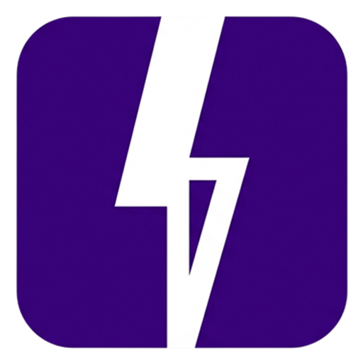

<p align="center">
  
</p>

<h1 align="center">ImgVault</h1>

<p align="center">
  save images, videos and links with the context that makes them findable later<br>
  <b>chrome extension (mv3)</b> · <b>next.js web app</b> · <b>rust native host</b>
</p>

<p align="center">
  <a href="LICENSE"></a>
  <a href="https://github.com/FahadBinHussain/imgvault/releases/latest"></a>
  <a href="https://github.com/FahadBinHussain/imgvault/actions/workflows/nextgen-extension-crx.yml"></a>
  
  
  
</p>

<table align="center">
  <tr>
    <td align="center" width="33%"><b>📸 save with context</b><br>right-click an image or link —<br>source url, page title, tags ride along</td>
    <td align="center" width="33%"><b>🔍 duplicate detection</b><br>hash + contextual checks catch<br>the same file saved twice</td>
    <td align="center" width="33%"><b>🎬 native downloads</b><br>a rust host runs yt-dlp for videos,<br>then hands them to the gallery</td>
  </tr>
  <tr>
    <td align="center" width="33%"><b>🗄️ gallery + collections</b><br>tags, collections, search,<br>trash with restore</td>
    <td align="center" width="33%"><b>🔐 encrypted vault</b><br>aes-256-gcm blobs with a passcode,<br>streamed back chunk by chunk</td>
    <td align="center" width="33%"><b>🌍 web app</b><br>same vault from next.js — auth,<br>gallery, share links, settings</td>
  </tr>
</table>

## what's in the repo

| path | what |
| --- | --- |
| `nextgen-extension/` | **the current extension** — react + vite + tailwind + daisyui, mv3, builds to `dist/` |
| `native-host/` | rust (tauri build path) native messaging companion for yt-dlp downloads |
| `web/` | next.js app router web app — nextauth, drizzle, neon postgres |
| `packages/` | pnpm workspace packages shared between extension and web (settings schema etc.) |
| `docs/` | architecture, workflows, api and gotchas notes |
| `old extension/` | legacy extension code, kept for reference only — don't load this |

## quick start

### extension (chrome / edge)

```bash
git clone https://github.com/FahadBinHussain/imgvault.git
cd imgvault/nextgen-extension
pnpm install
pnpm build
```

then `chrome://extensions` (or `edge://extensions`) → developer mode → **load unpacked** → pick `nextgen-extension/dist`.

manifest source of truth is `nextgen-extension/public/manifest.json` (currently mv3, min chrome 93) — bump its `version` with any extension change and reload with `pwsh tools/reload-extension.ps1`, which rebuilds `dist/` and self-reloads the extension.

### native host (windows)

```bash
cd native-host
pnpm install
pnpm run cargo:build     # portable package: pnpm portable:build
```

### web app

```bash
cd web
pnpm install
cp .env.example .env     # powershell: Copy-Item .env.example .env
pnpm dev
```

env vars are documented in [`web/.env.example`](./web/.env.example).

## how you use it

- **image**: right-click → save to ImgVault → review the captured metadata → it uploads to your configured host (pixvid / imgbb) and lands in the gallery with the source url and page title attached
- **video**: start a download through the native host → it lands in your local videos folder → the gallery upload flow picks it up → hosted on filemoon / udrop / terabox
- **link**: save the page → url, title and preview become a first-class vault item instead of a bare bookmark
- detail views come in a friendly and a nerds mode, so the raw hashes/dimensions/ids are one click away when you're debugging

uploads are strict, no fallback chains: the host picked in settings is the host used, and a failure says so loudly instead of silently bouncing to another provider.

## releases

every push that touches the extension or native host runs
[`.github/workflows/nextgen-extension-crx.yml`](./.github/workflows/nextgen-extension-crx.yml)
and publishes a github release with the extension `.zip` + `.crx` and the native host `.exe` attached — grab them from
[releases](https://github.com/FahadBinHussain/imgvault/releases/latest) (that's what the badge at the top tracks).

## screenshots

<p align="center">
  
  
  
</p>

<p align="center">
  
  
  
</p>

<p align="center">
  
  
  
</p>

## comparison

`✅` = built around that capability. `partial` = has a related feature, not the same workflow. `-` = not the point of that tool.

| Capability | ImgVault | [Eagle](https://eagle.cool/) | [Raindrop.io](https://raindrop.io/) | [Immich](https://immich.app/) | [Hydrus Network](https://hydrusnetwork.github.io/hydrus/) | [Google Photos](https://photos.google.com/) |
| --- | --- | --- | --- | --- | --- | --- |
| Browser capture from web pages | ✅ | ✅ | ✅ | - | partial | partial |
| Source URL, page title, and context-first metadata | ✅ | partial | ✅ | partial | partial | partial |
| Image/video/link records in one vault | ✅ | partial | ✅ | ✅ | ✅ | ✅ |
| Rich technical fields for debugging/auditing | ✅ | partial | partial | partial | ✅ | partial |
| Hash/context duplicate detection | ✅ | partial | partial | ✅ | ✅ | ✅ |
| Collections/tags/search | ✅ | ✅ | ✅ | ✅ | ✅ | ✅ |
| Native host or desktop companion | ✅ | ✅ | - | - | ✅ | partial |
| Authenticated web gallery and share links | ✅ | - | ✅ | ✅ | - | ✅ |
| Mobile camera backup | - | - | - | ✅ | - | ✅ |
| AI face/object/semantic search | - | ✅ | partial | ✅ | partial | ✅ |
| Open-source, self-modifiable stack | ✅ | - | - | ✅ | ✅ | - |

the closest overlap is eagle for design/reference collection and raindrop for bookmark-style capture. immich and google photos are much stronger at mobile photo backup and faces; hydrus is stronger at serious local tagging and big personal libraries. imgvault's niche is the bridge: browser capture, source-aware metadata, local/native handoff, a hosted gallery, and configurable upload hosts in one repo. the obvious backlog is mobile backup, ai search, and bulk tagging.

## docs

- [project overview](./docs/project-overview.md)
- [architecture](./docs/architecture.md)
- [extension workflows](./docs/extension-workflows.md)
- [web app api](./docs/web-app-api.md)
- [native host + yt-dlp](./docs/native-host-yt-dlp.md)
- [build and release](./docs/build-and-release.md)
- [known gotchas](./docs/known-gotchas.md)

## contributing

fork it, branch it, keep the diff focused, open a pr with build notes. local check is `pnpm build` in `nextgen-extension/` and in `web/`.

## license

[MIT](LICENSE)

## contributors

<a href="https://github.com/FahadBinHussain/imgvault/graphs/contributors">
  
</a>
